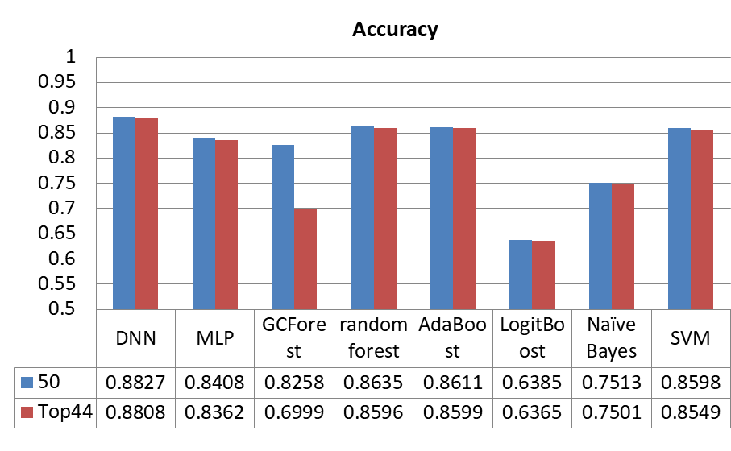

# Keras DNN for predicting Senile Dementia with Informant-Based Questionnaire

## About

### THIS PROJECT IS FOR RESEARCH PURPOSES ONLY

The goal of this project was to develop a Machine Learning model that could improve upon the results of the following research paper: [NMD-12: A new machine-learning derived screening instrument to detect mild cognitive impairment and dementia](./src/nmd-12_orig-paper.pdf).

## Data

The data itself is an informant-based questionnaire about the patient with 50+ questions that has been 'label-encoded'.  Most of them are binary, with some ordinal questions that have more than 2 options.  During the pre-processing portion of this project, we whittled the number of predictors down to 37.  Here is a snapshot of what the data looks like:

## The Code

### Description

Taking the basic knowledge I learned from CS 611, Artificial Neural Networks, and the Andrew Ng Deep Learning Coursera specialization, I built a grid search loop for the tunable hyper-parameters.  Here are the hyperparameters (as command-line arguments):

Here are command-line arguments that can be specified as single values OR comma-separated lists:
(i.e. --layers 2,3,4 will run model with each configuration of hyperparameters for 2-layer, 3-layer, and 4-layer)
'--layers', '--dropout', '--hl_neurons', '--learning_rate', '--hl_activation', '--epochs'
Defaults are 3, 0.2, 20, 0.005, 'tanh', and 20, respectively

Here are single-value arguments ONLY (no lists!)
'--batch_size', '--num_classes', '--output_activation'
Defaults are 32, 4, and 'softmax', respectively

### Running the Code

Run with defaults (this will only run the model once)
>>> ./dementia_dnn.py --debug all

Run with layers [2, 3],  dropouts [0.0, 0.2] and learning_rates [0.1, 0.01, 0.001]
>>> ./dementia_dnn.py --layers 2,3 --dropout 0.0,0.2 --learning_rate 0.1,0.01,0.001 --debug all
NOTE: This will run the model (2 X 2 X 3) = 12 times.  Notice that if you use multiple values of each hyperparameter in your grid search, the amount of run time adds up quickly!

### Dependencies

This code uses Keras with a Tensorflow back-end, though I don't think it matters what back end you use.  It is very basic, as it was the first neural network I've ever put together.  What a surprise I got when I was told that it would lead to a research paper!

## The Research

[Analyze Informant based Questionnaire for The Early Diagnosis of Senile Dementia Using Deep Learning](./src/DNN_SenileDementia_li.pdf).

Note that the research expanded to 6 categories of dementia after I developed this DNN.

## Authors

* **Dan McGonigle** [dpmcgonigle](https://github.com/dpmcgonigle)
